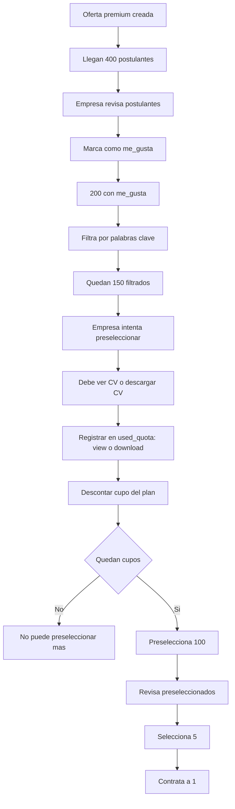

doiagrama.md
# Diagrama Visual Paso a Paso — Gestión de Cupos (view / download)

A continuación tienes un diagrama visual paso a paso que muestra exactamente **qué endpoints** intervienen, **qué decisiones** se toman y **qué tablas** se actualizan cuando una empresa filtra, ve o descarga CVs.

> Incluye: listado filtrado (sin gastar cupos), validación al abrir CV (gasta cupo), validación al descargar (gasta cupo), y cómo se actualizan los contadores `used_views`, `used_downloads` y `used_quota`.

---

## Paso a paso (explicado)

1. **Listado / Búsqueda** (`GET /v1/postulaciones/oferta/:ofertaId?keyword=`)

   * Ejecuta la query con joins a `postulante`, `oferta`, `empresa`, `plan`.
   * **No** registra consumo de cupos. Solo devuelve la lista filtrada.

2. **Selecciona un postulante**

   * El usuario escoge abrir o descargar el CV.

3. **Verificación central (middleware `validarQuota`)**

   * Recibe `empresaId`, `planId`, `ofertaId` y `postulanteId`.
   * Lee `planes.cupos` (o `oferta.cupos` si lo tienes ahí).
   * Calcula `used = SELECT SUM(count) FROM used_quota WHERE empresa_id = X AND plan_id = Y AND oferta_id = Z` (o lee registro consolidado).
   * Si `used >= cupos` → responder 403: cupos agotados.
   * Si `used < cupos` → permitir acción.

4. **Registrar la acción específica**

   * Si `view`: insertar/actualizar contador `used_views` (registro consolidado) o insertar registro en `used_quota_actions` para auditoría.
   * Si `download`: insertar/actualizar contador `used_downloads`.

5. **Registrar el consumo global**

   * Siempre incrementar `used_quota` (registro consolidado o registro nuevo en `used_quota` con count=1).
   * Esto es lo que se usa para comparar frente a `planes.cupos`.

6. **Retornar recurso**

   * Si fue `view`: devolver CV completo.
   * Si fue `download`: devolver archivo y marcar descarga.

---

## Endpoints sugeridos (resumen)

* `GET /v1/postulaciones/oferta/:ofertaId` → lista + filtros (NO gasta cupos)
* `POST /v1/cv/:postulanteId/view` → valida y registra `view` (gasta 1 cupo)
* `POST /v1/cv/:postulanteId/download` → valida y registra `download` (gasta 1 cupo)
* `GET /v1/ofertas/:ofertaId/quota` → devuelve `{ used, total, remaining }`
* `GET /v1/empresa/:empresaId/quota/history` → historial de consumos (audit)

---

¿Quieres que añada este diagrama como imagen o que genere el controlador + servicio exacto en NestJS con código listo para pegar? Puedo también poner el diagrama en formato PNG en canvas si lo prefieres.
